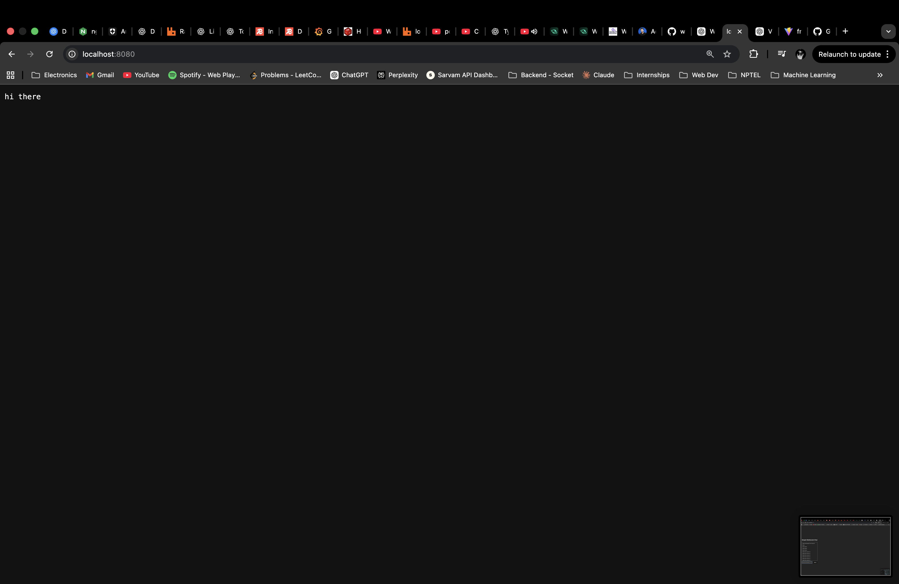
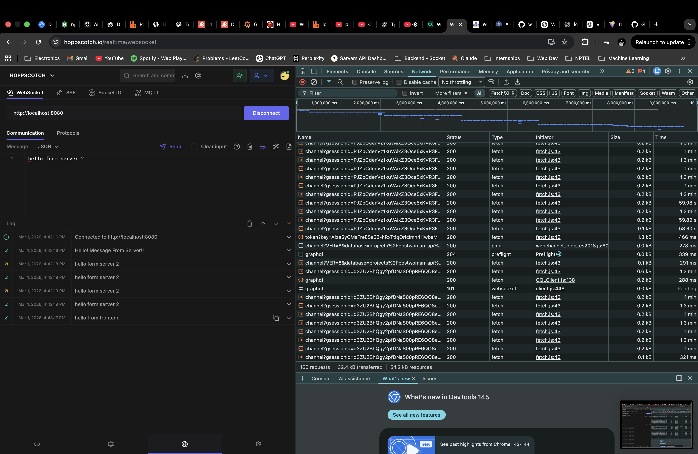
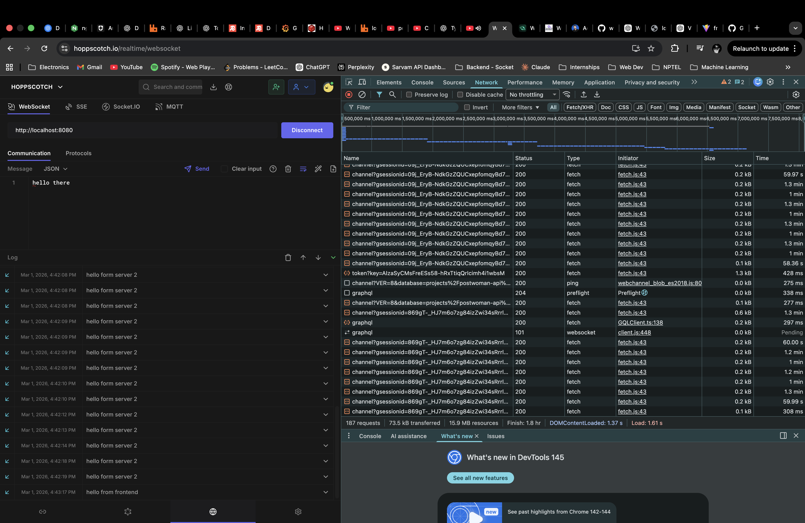
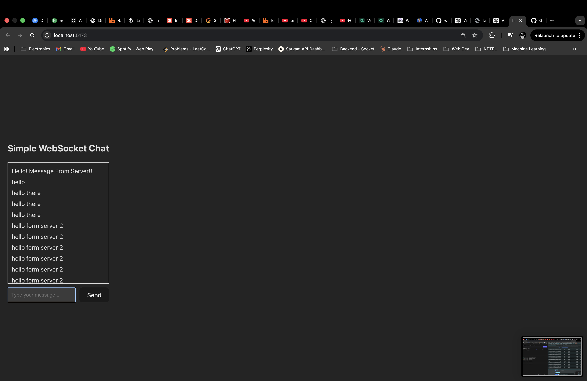

<!-- # websocket-testing -->

# Real - Time WebSocket Chat Application

A full - stack real - time chat application built using Node.js + WebSocket ( ws ) for the backend and React ( Vite + TypeScript ) for the frontend.

This project demonstrates real - time bidirectional communication, broadcast architecture, and WebSocket protocol handling without using external abstractions like Socket.IO.

---

### Project Overview

This application implements:
- Native WebSocket server using ws
- `HTTP` + `WebSocket` server on the same port
- Real - time broadcast to all connected clients
- React - based real - time UI
- Multi - client testing
- External WebSocket testing using `Hoppscotch`

---

### Folder Structure

```text

websocket-testing/
│
├── backend/
│   └── index.ts
│
├── frontend/
│   └── src/App.tsx
│
└── README.md

```

---

### Architecture

```text

Browser (React Client)
        │
        │  ws://localhost:8080
        ▼
Node HTTP Server + WebSocket Server
        │
        └── Broadcast to all connected clients

```


---

### Backend (Node.js + ws)

Technologies Used
- Node.js
- ws ( WebSocket library )
- Native HTTP server

Features Implemented
- HTTP server ( port 8080 )
- WebSocket upgrade handling
- Connection lifecycle management
- Message broadcasting to all active clients
- Server -> Client greeting message on connection
- Binary - safe message forwarding
- Ready state validation before sending


---

#### Key Logic :

```bash 

wss.on('connection', (ws) => {
    ws.on('message', (data, isBinary) => {
        wss.clients.forEach((client) => {
            if (client.readyState === WebSocket.OPEN) {
                client.send(data, { binary: isBinary });
            }
        });
    });

    ws.send('Hello! Message From Server!!');
});


```


---

### Frontend (React + Vite + TypeScript)

Technologies Used
- React
- Vite
- TypeScript
- Native WebSocket API

Features Implemented
- Automatic WebSocket connection on mount
- State - managed message list
- Real - time UI updates
- Input binding
- Send button + Enter key support
- Cleanup on unmount
- Multi - tab real - time synchronization

Core Concepts Demonstrated
- useEffect for connection lifecycle
- State management for streaming data
- Functional state updates for concurrent events
- Real - time rendering loop


---


### Testing Strategy

1. Multi - Client Browser Testing
- Opened multiple browser tabs
- Verified broadcast functionality
- Confirmed real - time synchronization
- Validated message consistency across clients

2. External Tool Testing
- Tested WebSocket endpoint using:

- Hoppscotch WebSocket Client

Verified:
- Manual message injection
- Server greeting message
- Bidirectional communication
- Cross - client broadcasting


3. HTTP Layer Testing

- Verified:
    ```bash
    http://localhost:8080
    ```

- Returns :

```
hi there
```



Confirms HTTP server and WebSocket share same port.


---

#### What This Project Demonstrates

- Understanding of WebSocket protocol
- Event - driven architecture
- Real - time systems fundamentals
- Client - server lifecycle handling
- Broadcast system design
- Low - level networking concepts
- Testing real - time systems using external tools
- Type - safe frontend - backend integration


---


#### How To Run

- Backend

```bash

cd backend
npx tsc
node dist/index.js

```



Here, is the screenshot of the connection to the server on Hoppscotch.



Here, is the another screenshot of the connection to the server on Hoppscotch.


Server runs on:

```bash

http://localhost:8080

ws://localhost:8080

```


---

#### Frontend

```bash
cd frontend
npm install
npm run dev
```



Here, is the screenshot of the frontend displaying all the messages that were sent through that server on Hoppscotch.


- Open:

```bash
http://localhost:5173

```


---

#### System Capabilities

- Supports multiple concurrent clients
- Real - time broadcast
- Full duplex communication
- Clean connection teardown
- Zero external real - time frameworks

---
